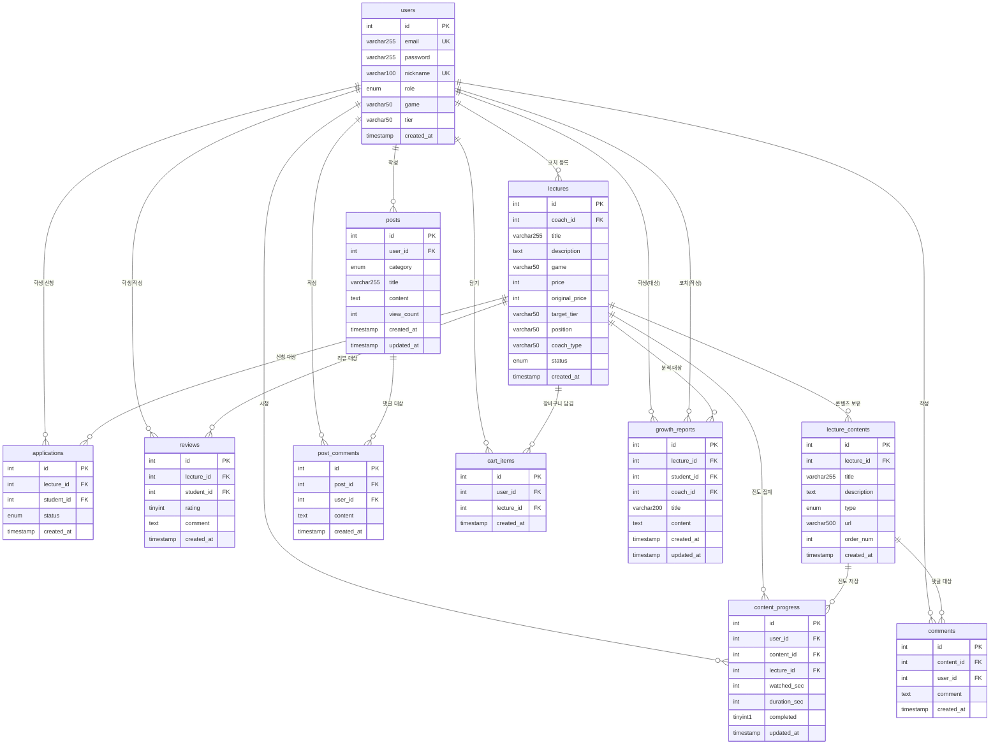

# GCP (Game Coaching Platform) — ERD

| 항목 | 내용 |
|------|------|
| 작성자 | 18 장현제 |
| 작성일 | 2026년 5월 8일 |
| DB | MySQL 8 (utf8mb4) |

---

## 1. 전체 테이블 목록

| # | 테이블명 | 단계 | 설명 |
|---|----------|------|------|
| 1 | users | P1 | 사용자 (학생/코치) |
| 2 | lectures | P1 | 강의 |
| 3 | applications | P1 | 수강 신청 |
| 4 | reviews | P1 | 강의 리뷰 |
| 5 | lecture_contents | P1 | 강의 콘텐츠 (영상/자료) |
| 6 | comments | P1 | 콘텐츠 댓글 |
| 7 | posts | P1 | 커뮤니티 게시글 |
| 8 | post_comments | P1 | 커뮤니티 댓글 |
| 9 | cart_items | P2 | 장바구니 |
| 10 | content_progress | P2 | 영상 진도율·이어보기 |
| 11 | growth_reports | P2 | 성장 분석 |

---

## 2. ERD 다이어그램 (Mermaid)



---

## 3. 테이블 상세 명세

### 3.1 users
```sql
CREATE TABLE users (
  id         INT AUTO_INCREMENT PRIMARY KEY,
  email      VARCHAR(255) NOT NULL UNIQUE,        -- 로그인 ID
  password   VARCHAR(255) NOT NULL,               -- bcrypt(salt=10) 해시
  nickname   VARCHAR(100) NOT NULL UNIQUE,        -- 닉네임
  role       ENUM('student', 'coach') NOT NULL DEFAULT 'student',
  game       VARCHAR(50),                         -- 주 게임
  tier       VARCHAR(50),                         -- 현재 티어
  created_at TIMESTAMP DEFAULT CURRENT_TIMESTAMP
);
```

### 3.2 lectures
```sql
CREATE TABLE lectures (
  id             INT AUTO_INCREMENT PRIMARY KEY,
  coach_id       INT NOT NULL,
  title          VARCHAR(255) NOT NULL,
  description    TEXT,
  game           VARCHAR(50) NOT NULL,
  price          INT NOT NULL DEFAULT 0,
  original_price INT,                             -- 정가 (할인 전)
  target_tier    VARCHAR(50),
  position       VARCHAR(50),
  coach_type     VARCHAR(50),
  status         ENUM('active', 'inactive') DEFAULT 'active',
  created_at     TIMESTAMP DEFAULT CURRENT_TIMESTAMP,
  FOREIGN KEY (coach_id) REFERENCES users(id) ON DELETE CASCADE
);
```

### 3.3 applications
```sql
CREATE TABLE applications (
  id         INT AUTO_INCREMENT PRIMARY KEY,
  lecture_id INT NOT NULL,
  student_id INT NOT NULL,
  status     ENUM('pending', 'approved', 'rejected') DEFAULT 'pending',
  -- P2: 결제 완료 시 즉시 'approved'로 INSERT
  created_at TIMESTAMP DEFAULT CURRENT_TIMESTAMP,
  UNIQUE KEY uq_application (lecture_id, student_id),  -- 중복 신청 방지
  FOREIGN KEY (lecture_id) REFERENCES lectures(id) ON DELETE CASCADE,
  FOREIGN KEY (student_id) REFERENCES users(id) ON DELETE CASCADE
);
```

### 3.4 reviews
```sql
CREATE TABLE reviews (
  id         INT AUTO_INCREMENT PRIMARY KEY,
  lecture_id INT NOT NULL,
  student_id INT NOT NULL,
  rating     TINYINT NOT NULL CHECK (rating BETWEEN 1 AND 5),
  comment    TEXT,
  created_at TIMESTAMP DEFAULT CURRENT_TIMESTAMP,
  UNIQUE KEY uq_review (lecture_id, student_id),       -- 중복 작성 방지
  FOREIGN KEY (lecture_id) REFERENCES lectures(id) ON DELETE CASCADE,
  FOREIGN KEY (student_id) REFERENCES users(id) ON DELETE CASCADE
);
```

### 3.5 lecture_contents
```sql
CREATE TABLE lecture_contents (
  id          INT AUTO_INCREMENT PRIMARY KEY,
  lecture_id  INT NOT NULL,
  title       VARCHAR(255) NOT NULL,
  description TEXT,
  type        ENUM('video', 'material') NOT NULL DEFAULT 'video',
  url         VARCHAR(500) NOT NULL,              -- YouTube embed URL 또는 자료 링크
  order_num   INT NOT NULL DEFAULT 0,
  created_at  TIMESTAMP DEFAULT CURRENT_TIMESTAMP,
  FOREIGN KEY (lecture_id) REFERENCES lectures(id) ON DELETE CASCADE
);
```

### 3.6 comments (콘텐츠 댓글)
```sql
CREATE TABLE comments (
  id         INT AUTO_INCREMENT PRIMARY KEY,
  content_id INT NOT NULL,
  user_id    INT NOT NULL,
  comment    TEXT NOT NULL,
  created_at TIMESTAMP DEFAULT CURRENT_TIMESTAMP,
  FOREIGN KEY (content_id) REFERENCES lecture_contents(id) ON DELETE CASCADE,
  FOREIGN KEY (user_id)    REFERENCES users(id) ON DELETE CASCADE
);
```

### 3.7 posts (커뮤니티 게시글)
```sql
CREATE TABLE posts (
  id         INT AUTO_INCREMENT PRIMARY KEY,
  user_id    INT NOT NULL,
  category   ENUM('question', 'tip') NOT NULL DEFAULT 'question',
  title      VARCHAR(255) NOT NULL,
  content    TEXT NOT NULL,
  view_count INT NOT NULL DEFAULT 0,
  created_at TIMESTAMP DEFAULT CURRENT_TIMESTAMP,
  updated_at TIMESTAMP DEFAULT CURRENT_TIMESTAMP ON UPDATE CURRENT_TIMESTAMP,
  FOREIGN KEY (user_id) REFERENCES users(id) ON DELETE CASCADE
);
```

### 3.8 post_comments (커뮤니티 댓글)
```sql
CREATE TABLE post_comments (
  id         INT AUTO_INCREMENT PRIMARY KEY,
  post_id    INT NOT NULL,
  user_id    INT NOT NULL,
  content    TEXT NOT NULL,
  created_at TIMESTAMP DEFAULT CURRENT_TIMESTAMP,
  FOREIGN KEY (post_id) REFERENCES posts(id) ON DELETE CASCADE,
  FOREIGN KEY (user_id) REFERENCES users(id) ON DELETE CASCADE
);
```

### 3.9 cart_items (P2)
```sql
CREATE TABLE cart_items (
  id         INT AUTO_INCREMENT PRIMARY KEY,
  user_id    INT NOT NULL,
  lecture_id INT NOT NULL,
  created_at TIMESTAMP DEFAULT CURRENT_TIMESTAMP,
  UNIQUE KEY uq_cart (user_id, lecture_id),           -- 중복 담기 방지
  FOREIGN KEY (user_id)    REFERENCES users(id) ON DELETE CASCADE,
  FOREIGN KEY (lecture_id) REFERENCES lectures(id) ON DELETE CASCADE
);
```

### 3.10 content_progress (P2)
```sql
CREATE TABLE content_progress (
  id           INT AUTO_INCREMENT PRIMARY KEY,
  user_id      INT NOT NULL,
  content_id   INT NOT NULL,
  lecture_id   INT NOT NULL,
  watched_sec  INT DEFAULT 0,                     -- 시청한 초
  duration_sec INT DEFAULT 0,                     -- 전체 영상 길이(초)
  completed    TINYINT(1) DEFAULT 0,              -- 98% 이상 시청 시 1
  updated_at   TIMESTAMP DEFAULT CURRENT_TIMESTAMP ON UPDATE CURRENT_TIMESTAMP,
  UNIQUE KEY uq_progress (user_id, content_id),  -- 중복 방지
  FOREIGN KEY (user_id)    REFERENCES users(id) ON DELETE CASCADE,
  FOREIGN KEY (content_id) REFERENCES lecture_contents(id) ON DELETE CASCADE,
  FOREIGN KEY (lecture_id) REFERENCES lectures(id) ON DELETE CASCADE
);
```

### 3.11 growth_reports (P2)
```sql
CREATE TABLE growth_reports (
  id         INT AUTO_INCREMENT PRIMARY KEY,
  lecture_id INT NOT NULL,
  student_id INT NOT NULL,
  coach_id   INT NOT NULL,
  title      VARCHAR(200) NOT NULL,
  content    TEXT NOT NULL,
  created_at TIMESTAMP DEFAULT CURRENT_TIMESTAMP,
  updated_at TIMESTAMP DEFAULT CURRENT_TIMESTAMP ON UPDATE CURRENT_TIMESTAMP,
  -- (lecture_id, student_id) 조합으로 1개만 유지 (재작성 시 UPDATE)
  FOREIGN KEY (lecture_id) REFERENCES lectures(id) ON DELETE CASCADE,
  FOREIGN KEY (student_id) REFERENCES users(id) ON DELETE CASCADE,
  FOREIGN KEY (coach_id)   REFERENCES users(id) ON DELETE CASCADE
);
```

---

## 4. 주요 제약조건 요약

| 테이블 | UNIQUE KEY | 설명 |
|--------|------------|------|
| users | email | 이메일 중복 가입 방지 |
| users | nickname | 닉네임 중복 방지 |
| applications | (lecture_id, student_id) | 같은 강의 중복 신청 방지 |
| reviews | (lecture_id, student_id) | 같은 강의 리뷰 중복 작성 방지 |
| cart_items | (user_id, lecture_id) | 장바구니 중복 담기 방지 |
| content_progress | (user_id, content_id) | 진도 중복 생성 방지 (UPSERT) |

---

## 5. 마이그레이션 파일 순서

P1/P2 초기 세팅 시 아래 순서로 실행해야 한다.

```bash
# 1. 기본 스키마 (users, lectures, applications, reviews)
mysql -u root -p < backend/src/db/schema.sql

# 2. 커뮤니티 (posts, post_comments)
mysql -u root -p game_coaching_platform < backend/src/db/migration_community.sql

# 3. 강의 콘텐츠 (lecture_contents, comments)
mysql -u root -p game_coaching_platform < backend/src/db/migration_contents.sql

# 4. P2 추가 테이블 (cart_items, content_progress, growth_reports)
mysql -u root -p game_coaching_platform < backend/src/db/migration_p2.sql

# 5. 더미 데이터 삽입 (선택)
mysql -u root -p game_coaching_platform < backend/src/db/seed.sql
```
